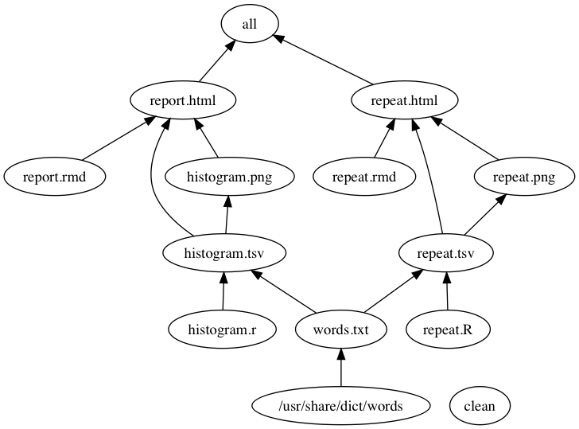

Hello welcome to my repo for hw09:)

Structure of my pipeline:

Changes I've made:
* Write a new R script to find the times of letters appearance repeated in a word 
* Write a new Rmd file to plot the result
* Change the Makefile
* Make a graph of my pipeline

You might want to check

File | Discription
-- | --
[Makefile](Makefile) | make file
[repeat.R](repeat.R) | Find the times of letters appearance 
[repeat.Rmd](repeat.Rmd) | Plot a histogram
[repeat.md](repeat.md) | .md output  
[repeat.html](repeat.html) | .html output 
[repeat.tsv](repeat.tsv) | Result file saved by repeat.R
[words.txt](words.txt) | Words input I've used. 
[out.png](out.png) | Structure of my pipeline

make-activity
=============

The commit history of this repository reflects what a student might do as she works through [this activity](http://stat545-ubc.github.io/automation04_make-activity.html) from [STAT 545](http://stat545-ubc.github.io). This fully developed example shows:

  * How to run an R script non-interactively
  * How to use `make`
    - to record which files are inputs vs. intermediates vs. outputs
    - to capture how scripts and commands convert inputs to outputs
    - to re-run parts of an analysis that are out-of-date
  * The intersection of R and `make`, i.e. how to
    - run snippets of R code
    - run an entire R script
    - render an R Markdown document (or R script)
  * The interface between RStudio and `make`
  * How to use `make` from the shell
  * How Git facilitates the process of building a pipeline
