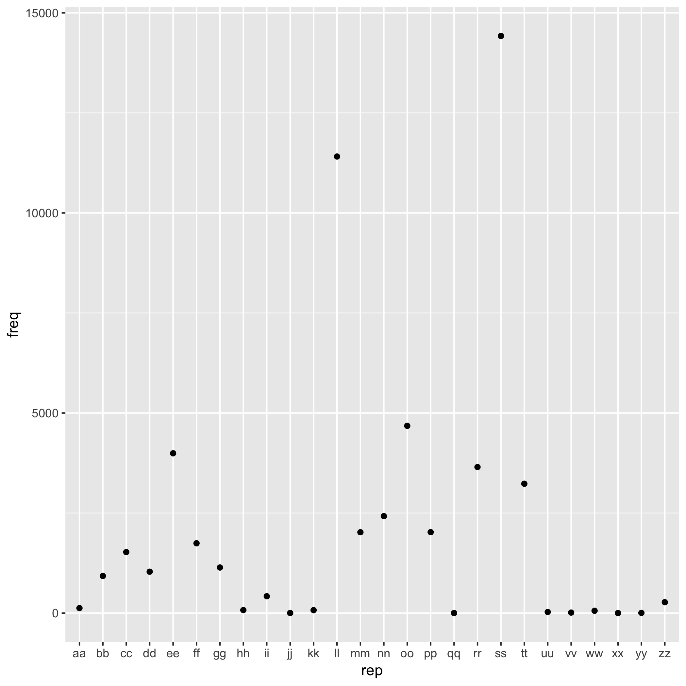

```{r}
repeat_dat <- read.delim("repeat.tsv")
```
I calculated the times of appearance of repeated letters in word.txt. 

Here is a histogram of the repeated letters.

The most frequent repeat letter is 's'.


